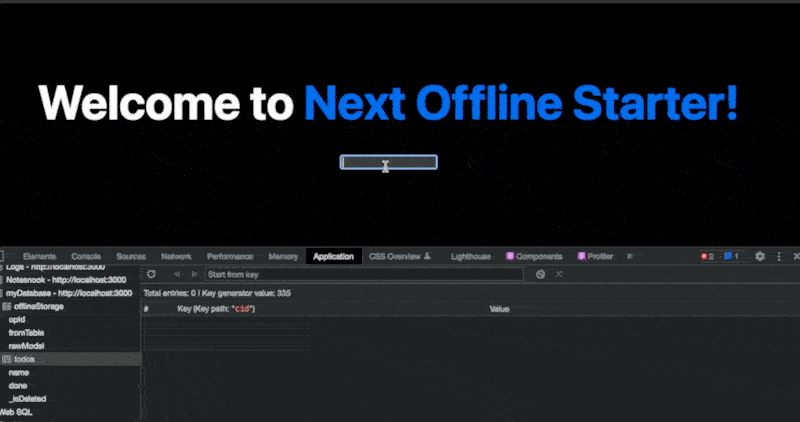

## Offline First Mongodb IndexDB Nextjs BoilerPlate 

```
On Change => update react state => update index DB through dexie.js


This template will help sync between IndexDB and MongoDB server 
```

Display image


## Getting Started

- create a .env with `MONGODB_URI` key
- run `yarn` or `npm i`
- run `yarn dev`